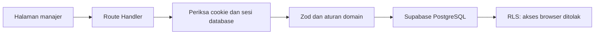

# Arsitektur implementasi awal

## Alur data

Browser tidak memakai kunci Supabase. Route Handler memeriksa sesi sebelum membaca/menulis data. Mutasi juga memeriksa Origin. Kunci layanan hanya digunakan dalam `lib/server/db.ts` yang diberi batas `server-only`.

## Penyimpanan ringkas

Skema enam tabel dijelaskan dalam [SUPABASE](SUPABASE.md), dan disetujui pemilik untuk proyek baru. `hub_records` berisi envelope `id`, `entity`, `data`, `created_at`, `updated_at`, dan `recurrence_key` opsional. `data` adalah JSONB dengan skema Zod **berbeda untuk setiap domain**. Enam belas domain memiliki allowlist tetap, bukan nama tabel dari input pengguna.

Keputusan ini menyederhanakan fondasi satu manajer. Konsekuensinya, query analitik lintas domain dan paginasi skala besar belum dioptimalkan seperti tabel terpisah. Relasi ID, dependensi melingkar, profil tunggal, dan kode bidang kerja tetap diperiksa database. Batas daftar 5.000 catatan per domain gagal jelas, bukan memotong angka dashboard diam-diam.

Kontrak API dan skema memisahkan kebutuhan UI dari penyimpanan. Bila skala membutuhkan normalisasi, pecah layanan dan migrasikan domain secara bertahap, disertai cadangan dan tes. Jangan menjalankan SQL reset lama.

## Modul kode

- `features/schemas.ts`: validasi dan tipe domain; tidak mengandung koneksi database.
- `features/catalog.ts`: label formulir, referensi, pilihan status, dan navigasi.
- `features/service.ts`: baca/simpan domain, pemeriksaan relasi dan dependensi.
- `features/Editor.tsx`: form lengkap atau tambah cepat; skema yang sama dipakai sebelum permintaan.
- `features/Records.tsx`: daftar/papan/aksi catatan. Kalender dipisah dalam `TaskCalendar`.
- `features/<domain>/`: komponen dan utilitas dikelompokkan berdasarkan domain sesuai tabel berikut.
- `features/reports/report-snapshot.ts`: pemilihan periode laporan yang dipakai server.
- `lib/progress.ts`: rumus bersama. Tanpa checklist wajib berarti belum dinilai, bukan 100% siap.
- `lib/date.ts`: tanggal kalender dan WIB, termasuk pengulangan bulanan pada akhir bulan.
- `tests/fixtures/legacy-plan`: rencana historis untuk uji kompatibilitas transaksi SQL; tidak diimpor runtime.

## Struktur folder aktif

| Folder | Tanggung jawab |
|---|---|
| `src/features/dashboard/` | Beranda dan Hari Ini |
| `src/features/tasks/` | Daftar, papan, kalender, detail, jadwal berulang dan kode tugas |
| `src/features/projects/` | Proyek, catatan, milestone dan target periode |
| `src/features/follow-ups/` | Pengingat, sematan dan tinjauan mingguan |
| `src/features/operations/` | Buku pencatatan dan rumus kas/stok |
| `src/features/meetings/` | Tautan rapat dan ekspor kalender |
| `src/features/reports/` | Tampilan dan snapshot laporan |
| `src/features/settings/` | Pengaturan profil, PIN dan cadangan |
| `src/features/roadmap/` | Halaman Gantt |
| `src/features/workspace/` | Orkestrasi halaman, cache, pencarian, lingkup dan navigasi |

Enam berkas lintas-domain tetap di akar features: schemas.ts, catalog.ts, query.ts, service.ts, Editor.tsx, dan Records.tsx. Komponen umum tetap di components, utilitas umum di lib, keamanan server di lib/server. Tidak ada barrel atau wrapper kompatibilitas; pemanggil memakai lokasi modul yang sebenarnya.

Tes dikelompokkan menjadi tests/unit, tests/ui, tests/database, dan tests/security. Fixture historis tetap di tests/fixtures; setup dan stub server-only tetap di akar tests karena dirujuk konfigurasi Vitest. SQL, skrip instalasi/reset, rute Next.js, dan stylesheet tidak dipindah.

## Transaksi dan keamanan

PIN di-hash scrypt dengan salt acak. Token sesi 32 byte acak; database menyimpan SHA-256 token. Cookie HttpOnly, SameSite Strict, Secure pada produksi, masa berlaku 12 jam. PIN lama tidak memiliki fallback.

Pembatasan lima percobaan dan penguncian 15 menit disimpan pada satu baris terkunci PostgreSQL. Jeda antarpencobaan bertambah. Login memverifikasi bahwa hash PIN belum berubah sebelum menyimpan sesi. Pergantian PIN mencabut semua sesi.

Tugas berulang dan pemulihan berjalan sebagai transaksi database. Fungsi template historis tetap tersedia di SQL untuk kompatibilitas, tetapi tidak dipanggil runtime. Tugas lanjutan memakai kunci unik dari ID asal dan tenggat agar klik selesai berulang tidak menggandakannya. Restore mengganti catatan dan snapshot laporan secara atomik; sesi, hash PIN, dan log audit tidak termasuk cadangan pengguna.

## Batas yang perlu dijaga

- Grafik penyelesaian menampilkan delapan minggu bergulir dari status/tanggal tugas saat ini; bukan arsip perubahan status.
- Gantt menyediakan rentang tanggal, zoom, geser/resize, tinjau/simpan dan formulir. Baseline serta jalur kritis otomatis belum tersedia.
- Laporan berisi kondisi saat snapshot dibuat. Status historis risiko/tugas yang sudah dibuka ulang tidak direkonstruksi ke masa lalu.
- Tautan dokumen divalidasi HTTP/HTTPS; unggah berkas belum tersedia.
- Aplikasi belum offline/PWA, dan tidak mengirim WhatsApp/email otomatis.
- UAT tiga hari, Lighthouse, dan perangkat Safari iOS/Chrome Android tetap perlu verifikasi terpisah.

## Proyek dan pengalaman ruang kerja

`Projects.tsx` menampilkan galeri dan detail proyek melalui `/proyek?id=<uuid>`. Sumber datanya tetap `workstreams`, diperkaya tujuan, catatan, PIC, tanggal mulai dan target. Nilai baru memiliki default agar catatan template lama tetap terbaca. `Records` menerima `scopeId` untuk menyaring tugas tanpa membuang konteks relasi/prasyarat dari workspace. Tugas baru dari proyek otomatis membawa `workstream_id`.

Tampilan daftar memakai tabel yang bergulir di dalam kontainer; papan dan kalender memakai sumber data/filter yang sama. Semua penyimpanan melewati API dan schema server yang sama, bukan penyimpanan terpisah di browser.

## Gantt dan catatan proyek

- `TaskTimeline.tsx` digunakan pada halaman global dan tab Gantt tugas proyek. `timeline.ts` menghitung potongan bar, pergeseran/resize, dan benturan prasyarat.
- Rentang render maksimal 366 hari; periode dapat digeser tanpa membatasi durasi proyek. Tugas di luar rentang tidak ditampilkan sebagai bar palsu di tepi.
- Pointer/keyboard hanya mengubah draf jadwal. Tombol Simpan mengirim satu tugas ke API; error mempertahankan draf. Perubahan tidak memindahkan prasyarat/turunan otomatis.
- `ProjectNotes.tsx` merender format judul/daftar/checklist/kutipan sebagai elemen React. Tidak ada `innerHTML`; catatan lama tetap terbaca sebagai teks.
- `workspace.css` berisi tampilan workspace dan komponen proyek; `globals.css` menyediakan kontrol dan layout dasar bersama.
