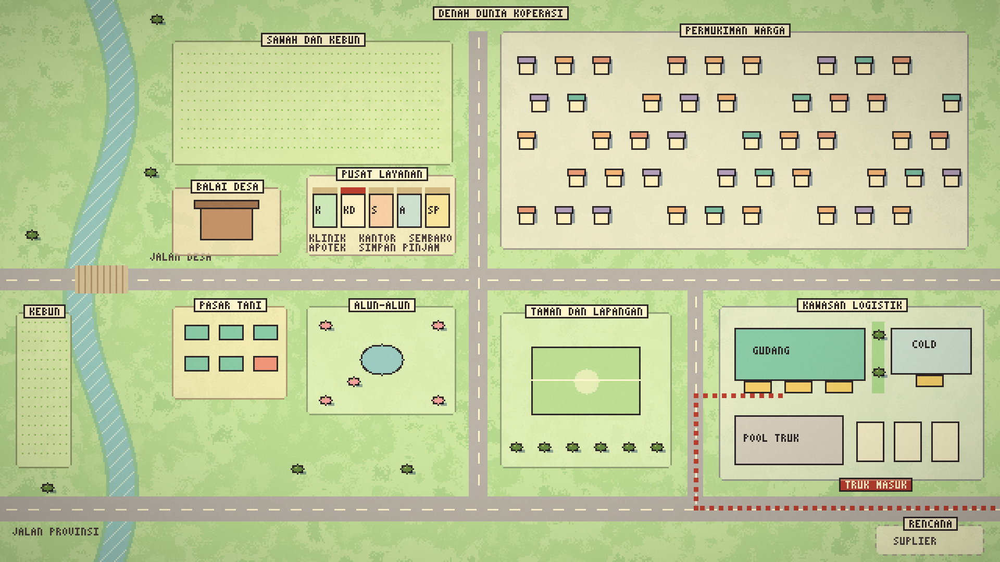

# Dunia Koperasi — kontrak gaya pixel dan rencana

Keputusan pemilik 7 Oktober 2026 (sesi `/grill-me`). Dokumen ini satu-satunya kontrak gaya dan rencana Dunia Koperasi; mengganti kontrak 3D isometrik lama. Kontrak dan kode 3D lama tersimpan di tag Git `arsip/dunia-3d-20261007` (riwayat, bukan acuan). Arahan langsung pemilik terbaru mengatasi konflik.

## Keputusan

| Topik | Keputusan |
|---|---|
| Teknologi | 2D top-down 3/4 (serong), PixiJS di browser. Tanpa Three.js. Render berhenti saat tab/dunia tidak terlihat. |
| Gaya | Pixel art ala Eastward: lapis ketinggian, fasad padat detail, garis tepi gelap berwarna, karakter berkepala besar. Bukan pastel. |
| Warna | Nada tanah dengan grading **Eastward**: kusam sinematik, olive-teal, sorotan hangat, bayangan biru-ungu. Merah-putih KDMP sebagai aksen tegas. |
| Mood | Desa modern Indonesia: bangunan KDMP modern, rumah genteng, sawah, aksen merah-putih (bendera, tenda, umbul-umbul). Cozy, tenang, lega. |
| Resolusi | Kanvas dasar 640×360 diperbesar bilangan bulat (3× pada 1920×1080), `image-rendering: pixelated`. |
| Aset | Digambar lewat kode (generator di `scripts/dunia-pixel/`) menjadi PNG/atlas. Pack berlisensi atau seniman bisa menyusul tanpa mengubah mesin. Uji perender 2.5D ditolak pemilik. |
| Orang | ±30×56 px, kepala besar, bayangan, pose: diam, jalan (samping), lambai, angkat, duduk, bicara. Variasi: hijab, peci, caping, helm, topi, kacamata, celemek, jas. |
| Kendaraan | Skala 24 px/m (panjang, tinggi) dan 12 px/m (kedalaman); lajur kiri; `pixel/vehicles.ts` (lalu lintas suasana, dok D1–D3 gudang + D4 cold storage, antre di pool, rute datang lalu mundur ke dok). Serong 3/4 (atap + sisi/muka). Truk boks KDMP, truk berpendingin, truk bak kayu bercat bermuatan karung bertutup terpal (komoditas), pikap, motor roda tiga, angkot, forklift. Digambar ulang ±1,6× agar sebanding dengan orang (P3). |
| Manajer | Avatar: otomatis mengikuti jadwal data, dapat diambil alih (WASD / ketuk-untuk-jalan). Rupa dipilih pengguna. |
| Organisasi | 7 unit KDMP (kantor, sembako, apotek, klinik, gudang komoditas, cold storage terpisah, simpan pinjam, logistik), staf dari data Tim, pengurus/pengawas dari data, balai desa (rapat anggota), warga sebagai latar anonim. Suplier/ekspedisi = kavling rencana. |
| Interaksi | Klik objek → penanda siku berdenyut + label → kamera zoom dan mengikuti → kartu. Aksi kartu membuka form operasional yang sudah ada (tanpa mutasi baru di dunia). |
| Kartu | Krem hangat, garis gelap, judul font pixel, isi font biasa, tombol ≥ 44 px; ponsel = lembar bawah. Contoh: `artifacts/dunia-pixel/interaksi.html` (lokal). |
| Waktu/musim | Waktu nyata WIB; musim hujan Okt–Mar / kemarau Apr–Sep; cuaca simulasi; dekorasi hari besar (Agustusan, Ramadan/Lebaran). |
| Progres | Tanpa poin/level. Progres visual dari data: kavling rencana → rangka → buka, rak terisi sesuai stok, truk datang sesuai Pengiriman. |
| Kehidupan latar | 6–10 sosok simulasi, berlabel *Simulasi lingkungan* bila diklik, berhenti saat reduced-motion. |
| Performa | Desktop 60 fps, Android kelas bawah ≥ 30 fps, unduhan aset awal < 1 MB. |

## Denah dunia

Sawah dan kebun (utara), sungai berjembatan (barat), pusat layanan di Jalan Desa (klinik, kantor, sembako, apotek, simpan pinjam), balai desa, pasar tani, alun-alun, taman dan lapangan, permukiman warga (timur laut), kawasan logistik di tenggara dekat Jalan Provinsi (gudang komoditas berdok miring, cold storage terpisah oleh taman, pool truk). Truk komoditas masuk dari Jalan Provinsi tanpa melewati permukiman. Denah ini rancangan; ukuran final ditetapkan di P3.

## Acuan visual

| Berkas | Isi |
|---|---|
| [kota-siang](dunia-pixel/kota-siang.png), [senja](dunia-pixel/kota-senja.png), [malam](dunia-pixel/kota-malam.png) | Pusat layanan, palet Eastward yang disetujui |
| [orang](dunia-pixel/orang.png) | 15 orang dan pose |
| [kendaraan](dunia-pixel/kendaraan.png) | Bentuk kendaraan (skala lama; digambar ulang di P3) |
| [dok-siang](dunia-pixel/dok-siang.png) | Dok gudang komoditas: lantai dok lebar, sumur truk menurun, ramp miring forklift, cold storage terpisah |

Aset aplikasi: `node --no-warnings scripts/dunia-pixel/aset.mjs` (ukuran dari `pixel/map.ts`; jalankan ulang setelah mengubah tapak bangunan). Generator preview: `node scripts/dunia-pixel/preview.mjs [nama]` → `artifacts/dunia-pixel/` (diabaikan Git). `VARIAN=terang|hangat|segar|teduh|stardew` hanya untuk uji warna; bawaan `eastward`.

## Paket kerja

| Paket | Isi | Status |
|---|---|---|
| P1 Preview | Gaya, palet, orang, kendaraan, denah, contoh interaksi | Selesai, disetujui (palet Eastward) |
| P0 Bersih | Tag arsip, hapus kode/dependensi/skill/referensi 3D, kontrak ini | Selesai |
| P2 Mesin | PixiJS, denah pixel `pixel/map.ts`, A* `pixel/path.ts`, kamera skala bulat `pixel/camera.ts`, avatar manajer (otomatis / WASD / ketuk tanah), penanda siku + kamera ikut, berhenti saat tersembunyi | Selesai (greybox; aset final P3) |
| P3 Eksterior | P3a bangunan/rumah/pohon dari `scripts/dunia-pixel/aset.mjs` → `public/dunia/` (+ lapisan `-malam` aditif), grading bersama `pixel/grade.ts`; P3b kendaraan skala baru + lalu lintas + truk dok dari Pengiriman; P3c perabot jalan dan detail area | P3a, P3b selesai |
| P4 Karakter | Animasi jalan 4 arah, staf dari data Tim, editor rupa manajer, warga simulasi (reasoning tinggi) | |
| P5 Interior | 9 ruang dengan transisi pudar; rak dari kolom Lokasi (reasoning tinggi) | |
| P6 Kartu | Kartu gaya baru, aksi cepat ke form operasional | |
| P7 Suasana | Waktu WIB, musim, cuaca, hari besar | |
| P8 QA | 360/768/1024/1440, fps, ukuran aset, tes/lint/build, dokumen | |

Urutan P3c → P4 → P5 → P6 → P7 → P8. Push ke `codex/dunia-koperasi` setiap paket selesai; PR ke main setelah P8 dan persetujuan pemilik. Uji perangkat fisik dilakukan pemilik.

## Keputusan P3c–P8 (sesi `/grill-me` 7 Oktober 2026)

**P3c perabot dan detail area.** Lampu jalan, tiang dan kabel listrik, bangku, tempat sampah, pot; air mancur, tiang bendera dan umbul-umbul alun-alun; 6 tenda pasar tani; pagar dan gerbang kawasan logistik; saung sawah; jemuran kampung. Hanya **papan pengumuman** di depan kantor yang dapat diklik (isi `noticeBoard`: keputusan terbaru dan dokumen akan kedaluwarsa); sisanya hiasan.

**P4 karakter dan tim.**
- Form Tim mendapat bagian opsional "Tampilan di Dunia Koperasi" (gaya halaman operasional, tanpa migrasi SQL karena `hub_records`):
  - **Rupa**: penutup kepala (tidak ada/hijab/peci/topi KDMP), rambut (pendek/panjang/ikal; diabaikan bila hijab), kulit (terang/sawo matang/gelap), kacamata (ya/tidak). Warna hijab dan baju mengikuti kolom Warna seragam. Semua kosong = sosok netral bertopi KDMP. Rupa tidak ditebak dari nama atau ID.
  - **Kedudukan**: karyawan (bawaan) / pengurus / pengawas; pengurus dan pengawas berbatik.
- Rupa avatar manajer diatur di kartu Karakter, disimpan di preferensi perangkat.
- Klik staf: manajer berjalan menghampiri, bubble "…" 3–4 detik, staf membalas ikon status tugas (✓ selesai, ⏳ proses, ! terlambat) dari data. Kartu staf: jadwal hari ini, tugas yang penanggung jawabnya sama persis dengan nama (abaikan huruf besar/kecil dan spasi tepi), tombol **Beri tugas** (form tugas dengan nama terisi). Mengubah penanggung jawab menjadi pilihan dari Tim = pekerjaan terpisah nanti.
- Warga simulasi mengikuti anggota aktif: 1 sosok per 25 anggota, minimal 4, maksimal 14; kartu "Simulasi lingkungan · N anggota aktif tercatat"; pencatatan belum aktif = jumlah minimal tanpa angka.
- Teknis: jalan 4 arah × 4 bingkai, pose diam/kerja/angkat/bicara, sprite dari generator.

**P5 interior.** Kantor (ruang rapat, meja tugas, area kegiatan, arsip, meja staf), balai desa, sembako, apotek, klinik, simpan pinjam, gudang komoditas (rak A–F), cold storage (C1–C3), toko umum untuk Gerai 1–3 (rak berisi barang ber-Gerai itu). Masuk lewat tombol Masuk (avatar berjalan ke pintu lalu pudar) atau menginjak pintu di mode kendali. Rapat: di balai desa bila Lokasi memuat "balai", selain itu ruang rapat kantor; yang hadir hanya Tim yang namanya tertulis di Peserta, Peserta kosong = hanya manajer.

**P6 kartu.** Seluruh UI dunia (header, dock, KPI, pelacak, daftar, detail, lembar bawah) krem bergaris gelap; judul dan label pendek memakai Pixelify Sans lewat `next/font`, isi data memakai font biasa.

**P7 suasana.** Peralihan halus pagi–siang–senja–malam menurut WIB. Cuaca bawaan otomatis menurut musim (Okt–Mar berawan/hujan sore, Apr–Sep cerah/berawan), tetap dapat dipilih manual, berlabel simulasi. Hari besar: Agustusan (1–31 Agustus), Ramadan sebulan dan Lebaran H-1 sampai H+7 menurut kalender Hijriah browser (tanpa klaim tanggal resmi), Hari Koperasi 12 Juli. Tanpa suara.

## Aturan yang tetap

- Data asli saja; simulasi berlabel; galat/belum aktif ≠ nol; tanpa angka atau nama karangan.
- Style dunia dibatasi `src/features/cooperative-world/world.css`; halaman operasional tidak berubah.
- Target sentuh ≥ 44 px, fokus keyboard, status bertulisan, reduced-motion, safe area.
- Lapisan data (`world-model.ts`, `npc/schedule.ts`, `truck-routes.ts`, `district.ts`, `layout.ts`) dipertahankan sampai diganti denah tile di P3.
