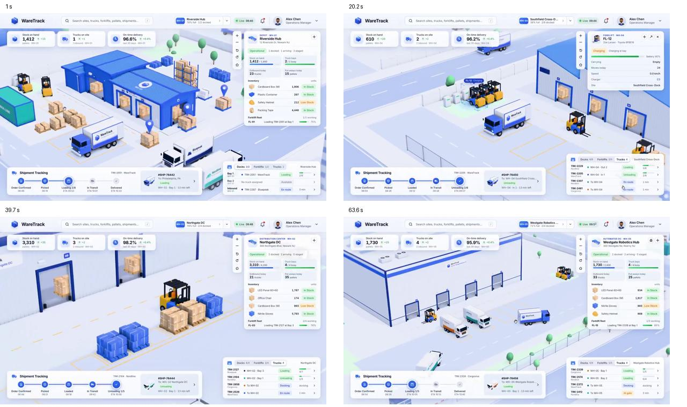

# Dunia Koperasi — kontrak desain dan implementasi

Acuan permintaan 4 Oktober, diperjelas 5 Oktober 2026. Prioritas pemilik: lingkungan, karakter dan UI mengikuti video, dengan backend yang siap dikembangkan. Target desain dan fitur nyata dibedakan di bawah.

## Satu acuan gaya yang wajib dijaga

Dokumen ini adalah **satu-satunya kontrak gaya dan rencana pengembangan Dunia Koperasi**. AGENTS mengatur proses/keamanan; STATUS hanya mencatat implementasi/bukti; LANJUTAN-AI hanya menunjuk pekerjaan berikutnya. DESAIN-ANTARMUKA mengatur halaman operasional dan mengarahkan dunia ke dokumen ini. Jangan menyalin spesifikasi dunia ke Markdown baru atau menganggap screenshot implementasi sebagai desain yang telah disetujui.

Arahan langsung pemilik terbaru mengatasi konflik. Jika gaya berubah atas permintaan pemilik, perbarui kontrak ini dan sumber kode bersama. Riwayat QA, PRD lama, dan PLAN-ASTRA-Kopdes.md bukan sumber gaya dunia yang mengalahkan kontrak ini. Jangan menghapus catatan pengguna hanya untuk mengurangi jumlah berkas.

**Yang dipertahankan:** perspektif isometrik 3D, bentuk maskot membulat, biru-putih, interior putih/kayu/kaca, komposisi kartu dari video, tujuh lahan gerai, style terisolasi. **Yang harus diperbaiki:** skala kawasan, kepadatan detail/interaksi, kendaraan, pencahayaan, keterlihatan kontrol waktu, gerak berpindah manajer, dan gym yang benar-benar digunakan karakter. Menjaga style bukan membekukan kekurangan versi sekarang.

## Referensi

- Video pengguna ssstwitter.com_1791130638800.mp4 berdurasi 72,26 detik; dianalisis empat frame pada 1,0 / 20,2 / 39,7 / 63,6 detik.
- [Delapan frame video](referensi-dunia/referensi_desain_video/) pada 0/12/20/32/40/44/52/64 detik (6 Oktober): acuan utama gudang, dok, truk, forklift, kartu detail, kartu tab dan pelacak pengiriman.
- [Contact sheet video](referensi-dunia/video-contact-sheet.jpg): sumber komposisi kartu dan lingkungan luar. Label/angka video tidak menjadi data aplikasi.
- [Interior pengguna](referensi-dunia/interior-pengguna.png): kantor cutaway isometrik, putih, kaca, workstation berkelompok, kayu muda. Referensi berwatermark tidak dipakai sebagai aset latar web.
- Screenshot QA lokal: artifacts/world-reference/qa/. Screenshot awal desktop sebelum penghapusan blur sudah usang; gunakan bukti terbaru pada STATUS.
- Implementasi tersimpan: [kawasan desktop](referensi-dunia/kawasan-1440.png), [interior desktop](referensi-dunia/interior-1440.png), [interior ponsel](referensi-dunia/interior-360.png). Ini dokumentasi keadaan render, bukan pengganti referensi video atau tanda desain final disetujui.



## Gaya dan palet

Diorama 3D bersih, objek membulat ringan, cahaya lembut, bayangan kontak, detail terbaca. Kamera ortografis menampilkan sisi atas dan dua sisi objek. Hindari pixel art, outline komik, neon, gradien pelangi, foto stok sebagai dunia dan angka dekoratif. Target mengikuti video belum berarti identik piksel atau sudah diterima pemilik.

| Peran | Nilai sumber |
|---|---|
| Biru objek / UI | #3866f6 / #426bf4 |
| Biru gelap atap/trim | #2443a6 |
| Putih objek | #fafcff |
| Kaca | #a7c8e9 |
| Lantai kawasan | #e9eefb |
| Vegetasi | #5fbf8a / #9fdcb2 |
| Kayu muda | #dfc59c |
| Aksen kardus | #f2b36b / #d9944a |
| Aksen marka/forklift | #f5c542 |
| Teks UI | --cw-ink: #263750 |
| Metadata UI | --cw-muted: #74839b |
| Garis | --cw-line: #e4eaf4 |
| Kartu putih transparan | --cw-card: rgba(255,255,255,.94) |

Sumber aktual: objects/primitives.ts (palet), lighting.ts (cahaya per jam/cuaca) dan world.css. Palet literal Three.js merupakan palet dunia; jangan memakainya untuk mengganti token semua halaman. Bila pemilik mengubah palet, ubah sumber dan tabel ini bersama.

## Komposisi kartu seperti video

Desktop ≥ 1024 px memakai kartu mengambang seperti video; layar lebih kecil memakai lembar bawah.

1. **Header** putih 64 px (58 px < 1024): logo, pencarian (memfilter kartu Daftar), pemilih zona berlencana biru, chip **Suasana** (ikon cuaca + waktu, membuka pengaturan), jam WIB, profil manajer. Ponsel < 600 px: logo saja, chip suasana ikon saja.
2. **Tiga KPI** kiri atas (196 px): ikon dalam kotak biru pucat, label, angka 24 px, catatan sumber (mis. "2 sedang dikerjakan", "Berikutnya 13:00 WIB"). Memuat/galat memakai tanda —. < 1024 px menjadi chip geser tanpa catatan.
3. **Kartu detail** kanan atas (320 px): eyebrow biru kapital (mis. `GUDANG · 4 DOK`, `LAHAN 03 · BOULEVARD GERAI`), judul 18 px, subjudul, tombol tutup; pill status bertulisan + keterangan; ubin meter dengan progress, baris kunci–nilai, tombol utama biru. Isi bergulir.
4. **Kartu Daftar** kanan bawah, pengganti Docks/Forklifts/Trucks: tab Lokasi / Tugas / Rapat dengan hitungan; baris ikon + judul + keterangan + pill status + panah. Lokasi memilih objek dan menerbangkan kamera; Tugas/Rapat membuka catatan asli.
5. **Pelacak "Jadwal hari ini"** kiri bawah, pengganti Shipment Tracking: langkah rapat hari ini (Selesai / Berlangsung / Nanti, jam WIB) dan kartu rapat berikutnya; tanpa rapat menampilkan tautan Tugas/Kegiatan. Saat domain Pengiriman tersedia, pola langkah yang sama dipakai untuk tahap pengiriman. Disembunyikan 1024–1279 px agar tidak bertabrakan dengan dock.
6. **Label mengambang** di objek terpilih berubah biru dengan status (mis. "Gudang koperasi · 4 dok"), ditambah kotak sorot biru (garis tepi + alas transparan) di scene.
7. **Kontrol kamera** di kiri kartu kanan: zoom, putar, reset. Fokus kamera digeser ke tengah area yang tidak tertutup kartu kanan atau lembar bawah (`occlusion`).
8. **Dock** Beranda, Kawasan, Kantor, Karakter, Suasana; ≥ 1280 px berada di kanan pelacak.
9. **Lembar bawah** (< 1024 px): pegangan seret/klik untuk posisi ringkas → setengah → penuh, baris ringkasan (objek terpilih + rapat berikutnya/tugas terbuka), tab Detail / Daftar / Hari ini. Memilih zona menciutkan lembar agar scene terlihat; memilih objek membukanya setengah.

Token di `world.css`: kartu putih radius 14 px, border `#e6ebf5`, bayangan `0 8px 24px rgba(30,50,100,.08)`, Inter, angka tabular, teks minimal 11 px. Pill: hijau aktif/berlangsung, biru info/proses, kuning persiapan, abu kosong/selesai, merah galat. Tanpa backdrop blur.

## Exterior

Koordinat ada di `layout.ts` (X ke timur, Z ke selatan; kamera dari tenggara). Kawasan 62 × 50 unit:

- Jalan utama di utara (Z −21,5) dengan pagar, gerbang berpalang dan pos jaga; jalan gerbang ke selatan sampai jalan dalam (Z 0,5); boulevard gerai (Z 13,5) dan jalan penghubung X −3.
- Parkir antre truk tiga petak di barat laut (marka putih saja).
- Gudang 24 × 10 di pusat [3, −13] dengan empat pintu dok D1–D4 di sisi selatan, halaman dok bermarka kuning, area staging berpalet kardus/kemasan biru di timur dan area pengisian forklift di barat. Kardus, forklift dan marka adalah pemandangan, bukan stok/pengiriman tercatat. Klik membuka panel Gudang dengan tautan ke daftar Barang.
- Kantor koperasi 8 × 5,4 di [−12, 7,2], dapat diklik langsung atau lewat penanda untuk masuk interior. Taman/titik kumpul di [10, 7,2], parkir mobil kecil bermarka di timurnya.
- Tujuh lahan 6,4 × 5,4 di Z 19,6, X −24 sampai 24 berjarak 8. Bidang kosong hijau pucat dengan garis batas dan tanda tambah.
- Gerai dari domain units: kolom **Lahan di Dunia Koperasi** (`slot`: otomatis atau 1–7) menempatkan gerai di lahan pilihannya sehingga tidak bergeser saat gerai lain dihapus. Pilihan ganda dimenangkan gerai yang dibuat lebih dulu; sisanya, termasuk otomatis, mengisi lahan kosong sesuai created_at lalu ID. Gerai di luar tujuh lahan tetap ada di daftar Gerai; jumlahnya diberitahukan.
- Nama/status bangunan dari catatan asli. Detail membuka catatan yang sama melalui recordHref.
- Pemilih zona di header (Semua kawasan / Kantor / Gudang / Boulevard gerai) dan pilihan lahan/gudang dari daftar menggerakkan kamera mulus ke tujuannya; klik di scene tidak memindahkan kamera.
- Objek statis digabung menjadi satu mesh berwarna per titik per objek (`mergeStatic`); objek yang dapat diklik digabung per objek agar raycast tetap mengenali pilihan. Ukuran pratinjau 1280 px kualitas Sedang: 129 draw call termasuk bayangan.

Belum tersedia drag/editor lahan. Truk dan pengiriman muncul setelah domain Pengiriman tersedia.

## Interior dan karakter

Kantor cutaway tanpa atap/dinding depan. Empat area: meja rapat kayu muda dengan enam kursi, workstation komputer, arsip/buku, treadmill kegiatan. Penanda/detail membuka /rapat, /tugas, /dokumen, /pencatatan atau /jurnal.

Karakter berupa kelompok mesh kepala/rambut/topi/mata/pipi/mulut/badan/lengan/kaki. Bentuk membulat dan proporsi maskot, tiga variasi penampilan. Gerak dihitung dalam loop animasi. Pakaian utama dapat dipilih biru/lavender/hijau.

| Pemicu | Animasi | Makna |
|---|---|---|
| Rapat sedang berlangsung berdasarkan WIB/durasi | Duduk rapat | Jadwal, bukan bukti kehadiran pegawai |
| Jurnal bertanggal hari ini WIB | Gym/olahraga | Simbol kegiatan, bukan klaim kegiatan nyata adalah olahraga |
| Tugas berstatus proses | Bekerja | Visualisasi tugas dalam proses |
| Tanpa pemicu | Idle/gerak tangan/kepala | Suasana lingkungan |

Prioritas global: rapat → jurnal hari ini → tugas proses → idle. Mode pratinjau gerakan tidak mengubah catatan. Bubble di atas kepala maskot utama muncul ketika dipilih, memakai konteks catatan atau teks pratinjau. Belum ada AI chat, suara, avatar pegawai nyata atau kehadiran tim.

## Cuaca dan waktu

Cuaca manual cerah/berawan/hujan. Hujan memakai partikel garis exterior; cuaca memengaruhi latar dan intensitas cahaya. Pencahayaan pagi/siang/senja/malam atau otomatis WIB. Jam UI tetap WIB aktual meskipun cahaya manual. Jam diperbarui setiap 60 detik; tick tidak membangun ulang geometri/kamera.

Preferensi {version:1, weather, time, outfit, quality} divalidasi worldPreferencesSchema dan disimpan usePreference dengan key hub-world-preferences-v1. Nilai korup kembali ke default. Penyimpanan lokal perangkat, belum antarperangkat. Reduced-motion menghentikan gerakan periodik karakter/hujan dan animasi CSS.

## Berkas dan backend

Semua berkas dunia berada pada src/features/cooperative-world/:

| Berkas | Peran |
|---|---|
| CooperativeWorld.tsx | State, tata letak desktop/lembar bawah, dock, preferensi |
| ui/WorldHeader, KpiCards, DetailCard, ListCard, TodayTracker, MobileSheet | Komponen kartu ala video |
| WorldScene.tsx | WebGL, kamera, raycast, proyeksi penanda, animasi, disposal |
| layout.ts | Koordinat lahan, kantor, stasiun interior, posisi karakter, bidang pandang kamera |
| objects/primitives.ts | Palet dan bentuk dasar; geometri/material dipakai bersama lalu dibuang saat scene dibongkar |
| objects/props.ts, office.ts, exterior.ts, characters.ts | Perabot, gedung/interior, kawasan, maskot dan gerakan |
| lighting.ts | Fungsi murni pencahayaan pagi/siang/senja/malam dan cuaca |
| render-quality.ts | Tingkat kualitas Tinggi/Sedang/Hemat dan deteksi perangkat |
| world-model.ts | Adapter data, tujuh slot, prioritas aktivitas, Zod preferensi, jam WIB |
| world.css | Style dunia dan breakpoint |

Integrasi melalui WorkspacePage/useWorkspace, workspace-scope, catalog dan AppShell. Domain yang dimuat: organization, workstreams, units, work-items, meetings, journal. /dev/dunia-koperasi hanya development dan memakai workspace kosong tanpa database.

Backend tetap API domain dengan sesi, Zod, Origin dan RLS. Dunia membaca data serta membuka editor asli; tidak menulis diam-diam. Tidak ada tabel baru, supplier domain, migrasi 8 atau reset dalam paket ini. Jangan mengambil paket commit 4a0c01d secara massal: implementasi terdahulu itu dibatalkan oleh 751c4c2.

## Koneksi dunia dengan web

Fokus visual dan koneksi dikembangkan pada aplikasi ini, bukan proyek demo terpisah. Workspace/API yang sudah ada tetap satu sumber catatan. Gerai muncul dari units; tugas dari work-items; rapat dari meetings; kegiatan dari journal; identitas dari organization/profil. Catatan proyek/workstreams mempertahankan relasi yang sudah ada.

Klik objek membuka detail atau editor modul asli melalui recordHref. Setelah penyimpanan berhasil, invalidasi/refresh workspace memperbarui dunia; jangan menambah salinan database gerai/tugas. Periksa koneksi tambah/ubah gerai, perubahan status tugas, jadwal rapat dan kegiatan menggunakan data uji yang terkendali. Mode dev kosong hanya bukti render, bukan bukti sinkronisasi data nyata.

Paket berikut dimulai dari terang/kontrol waktu/perluasan map sesuai rencana di bawah; integrasi adapter dipertahankan sepanjang paket. SQL cloud/pengiriman nyata hanya bila kebutuhan data tidak dapat ditangani domain yang ada, dengan proses MIGRASI-SQL. Jangan mengarang domain pengiriman untuk kendaraan suasana.

## Cara AI berikutnya meningkatkan lingkungan

1. Periksa Git, dokumen ini, screenshot terbaru dan kode; pertahankan perubahan pemilik.
2. Untuk gedung/perabot/karakter, ubah fungsi mesh di objects/; koordinat di layout.ts. Pertahankan ID klik, ukuran relatif dan skala dunia.
3. Untuk UI, ubah world.css/CooperativeWorld.tsx. Pertahankan komposisi video, ketajaman teks, data asli dan kontrol sentuh.
4. Aturan gerai/aktivitas di adapter dengan tes; simulasi tidak boleh menjadi data operasional.
5. Layout permanen, editor lingkungan, suplier/pengiriman, kendaraan dan karakter pegawai memerlukan kontrak data tersendiri. Skema harus kompatibel; migrasi cloud mengikuti persetujuan pengguna.
6. Verifikasi tes, tipe, lint, build, empat lebar, klik gedung, kamera, interior, bubble, cuaca, reduced-motion dan galat. Perbarui STATUS dari bukti nyata.

## Batas penerimaan

Kemiripan detail dengan video, kelengkapan interaksi, kontras semua label, target sentuh semua kontrol, fallback WebGL, semua viewport/state, perangkat fisik dan kinerja perangkat rendah belum boleh dinyatakan selesai dari tes DOM/build. Bukti aktual ada pada [STATUS](STATUS.md) dan [CHECKLIST](CHECKLIST.md).

## Rencana Dunia Koperasi v2 — disetujui pemilik 6 Oktober 2026

Status: **rencana disetujui, belum diimplementasikan**. Menggantikan rencana revisi 5 Oktober. Pekerjaan dunia v1 yang sempat dibuat lalu dinilai kacau diarsipkan pada tag `arsip/dunia-v1-20261005` dan dibatalkan di main (commit 9551476). Jangan menggabungkan ulang cabang/tag itu secara massal; ambil gagasan atau berkas tertentu saja setelah diperiksa.

Acuan visual utama: [delapan frame video](referensi-dunia/referensi_desain_video/) (00–64 detik). Label, merek dan angka di video bukan data aplikasi.

### Keputusan pemilik

1. **Tetap 3D low-poly**, bukan pixel art. Ringan dicapai lewat teknik render, bukan ganti gaya.
2. **Tambah entitas Pengiriman (`deliveries`) dan Mutasi stok (`stock-movements`).** Stok buku hanya berubah lewat tombol konfirmasi yang mencatat mutasi. Satu migrasi SQL; cloud tetap menunggu persetujuan sesuai [MIGRASI-SQL](MIGRASI-SQL.md).
3. **Lima seksi kantor:** layanan anggota, administrasi & keuangan, usaha & gerai, gudang & logistik, umum.
4. **Paket 0 merapikan folder** sebelum paket dunia. Berkas besar dirapikan saat disentuh; `personal.css` menjadi paket tersendiri di akhir.
5. **Tujuh ide tambahan** di bawah masuk rencana.
6. Setiap paket: tag checkpoint, commit kecil, PR ke main hanya setelah pemilik menilai screenshot/rekaman.

### Gaya dan performa

- Palet tetap biru-putih, ditambah aksen dari video: oranye kardus `#f2b36b`, kuning marka/forklift `#f5c542`, hijau pohon lebih jenuh. Siang lebih cerah, bayangan kontak tegas; hindari tampilan pucat/abu-abu.
- Objek berulang memakai instancing/geometri gabungan; render saat ada gerak; DPR ponsel ≤ 1,5; bayangan hanya desktop; NPC jauh memakai model sederhana; animasi berhenti saat tab tersembunyi.
- Tingkat kualitas Tinggi/Sedang/Hemat otomatis dengan pilihan manual di Suasana.
- Anggaran: desktop < 150 draw call dan 60 fps; ponsel menengah < 80 draw call dan stabil 30 fps.

### Tata letak kawasan (± 4× luas v0)

```
                 JALAN UTAMA (truk suplier masuk) ══════════════════════
   ┌─ Gerbang + pos ─┐   ┌──────────── GUDANG KOPERASI ────────────┐
   │  Parkir truk    │   │ Rak palet │ Penerimaan/QC │ Stok dingin  │
   │  antre (2–3)    │   └──Dok 1──Dok 2──Dok 3──Dok 4─────────────┘
   └─────────────────┘      halaman bongkar-muat, marka kuning, forklift
   ═══════ JALAN DALAM KAWASAN (kendaraan & pejalan kaki) ═══════════
   ┌──── KANTOR KOPERASI (cutaway) ──────────────┐   ┌─ Taman/titik kumpul ─┐
   │ Layanan anggota │ Administrasi & Keuangan    │   │ bangku, pohon,       │
   │ Ruang rapat     │ Usaha & Gerai              │   │ papan pengumuman     │
   │ Ruang manajer   │ Gudang & Logistik │ Pantry │   └──────────────────────┘
   │ Gym/kegiatan    │ Arsip                      │
   └─────────────────────────────────────────────┘
   ═══════ BOULEVARD GERAI ══════════════════════════════════════════
   [Lahan 1] [Lahan 2] [Lahan 3] [Lahan 4] [Lahan 5] [Lahan 6] [Lahan 7]
```

- Gudang besar seperti video dan dapat dibuka seperti kantor.
- Pemilih zona di header meniru dropdown situs pada video: Semua kawasan / Kantor / Gudang / Boulevard gerai; kamera berpindah mulus.
- Lahan memakai kolom `slot` (1–7) pada Gerai; tanpa slot memakai urutan lama.
- Pin biru hanya dari data nyata: stok di bawah minimum, pengiriman tiba hari ini, dokumen akan kedaluwarsa, tugas lewat tenggat.
- Truk suplier hanya dari pengiriman berstatus dalam perjalanan/tiba. Kendaraan suasana berlabel *Simulasi lingkungan*.

### NPC karyawan dan manajer

NPC karyawan berasal dari *Tim gerai* berstatus ditunjuk/aktif, dengan kolom baru: seksi, tempat kerja (kantor/gudang/gerai), jam kerja, penampilan (warna baju, rambut). Data kosong → meja kosong dan ajakan menambah tim. NPC anonim hanya di mode pratinjau berlabel.

| Prioritas | Kondisi dari data (WIB) | Perilaku |
|---|---|---|
| 1 | Rapat berlangsung dan nama di peserta; peserta kosong → semua staf kantor | Ke ruang rapat, duduk |
| 2 | Pengiriman tiba, staf seksi gudang & logistik | Ke dok, bongkar, bawa kardus |
| 3 | Tugas proses dengan penanggung jawab = nama staf | Bekerja di meja seksi |
| 4 | 12:00–13:00 | Pantry |
| 5 | Jam kerja tanpa pemicu | Keliling: seksi lain → gudang → gerai → kembali |
| 6 | Di luar jam kerja | Pulang; lampu kantor redup |

Manajer (maskot utama): briefing pagi singkat di titik kumpul; siang keliling seksi, berhenti di meja staf dengan tugas lewat tenggat, ke dok saat truk tiba dan berbicara dengan sopir, mengunjungi lahan berstatus persiapan; sore kembali ke ruang manajer. Rapat/kegiatan aktif mengalahkan keliling.

Interaksi: dua NPC berpapasan berhenti, saling menghadap, bubble ikon 3–5 detik; serah-terima kardus gudang → gerai; staf melapor ke manajer. Teks bubble hanya judul catatan asli atau ikon umum; jeda jarang, tidak menumpuk. Kartu NPC menyatakan posisi adalah **visualisasi jadwal/tugas, bukan bukti kehadiran**. Reduced-motion menghentikan gerak; NPC ditempatkan di lokasi bermakna.

### UI kartu seperti video

1. **KPI kiri atas:** ikon dalam kotak biru pucat, angka besar, label dan sumber. Default: stok barang, pengiriman hari ini, tugas terbuka; berganti per zona.
2. **Kartu detail kanan:** eyebrow biru kapital (`GUDANG · DOK 2`), judul tebal, sub-judul, pill status bertext, baris kunci–nilai, progress tipis, daftar barang dengan pill Cukup/Di bawah minimum.
3. **Kartu tab kanan bawah:** Dok / Tim / Kendaraan atau Gerai / Tugas sesuai zona.
4. **Pelacak pengiriman bawah:** Dipesan → Dikirim → Tiba → Diperiksa → Masuk stok, plus kartu ringkas pengiriman terpilih.
5. **Label mengambang** di objek terpilih dan kotak sorot biru.

Radius 14 px, border `#e6ebf5`, bayangan lembut, Inter, angka tabular, tanpa blur latar.

- **Ponsel 360–767:** header 56 px (logo, pill zona, jam WIB, avatar); KPI chip geser ± 64 px; kontrol kamera kolom kecil kanan; detail menjadi bottom sheet tiga posisi (ringkas/setengah/penuh) yang memuat kartu tab dan pelacak sebagai tab; tanpa pilihan hanya strip "Pengiriman berikutnya" di atas dock.
- **Tablet 768–1023:** panel kanan 320 px, pelacak bawah. Area sentuh ≥ 44 px, status selalu bertext.

### Fitur web pendukung

| Fitur | Isi | Di dunia |
|---|---|---|
| Pengiriman `deliveries` | Arah masuk/keluar, suplier/ekspedisi (Mitra), gerai tujuan, tanggal rencana/tiba, dok, sopir/plat opsional, status 5 tahap, baris barang dipesan vs diterima, selisih/rusak, bukti | Truk, dok, pelacak, pin |
| Mutasi stok `stock-movements` | Jejak perubahan stok buku: penerimaan, kirim ke gerai, penyesuaian opname; hanya lewat tombol konfirmasi | Kardus bergerak, isi rak |
| Suplier & ekspedisi | Kategori baru pada Mitra & kontak, barang dipasok, termin; tanpa tabel ganda | Label truk, kartu kendaraan |
| Tim & seksi | Kolom seksi, tempat kerja, jam kerja, penampilan pada Tim gerai; halaman struktur tim per seksi | NPC, meja seksi |
| Lokasi barang | Lokasi (gudang/gerai) dan rak pada Barang | Rak, pin stok minimum |
| Slot lahan | `slot` pada Gerai | Posisi gerai tetap |
| Ringkasan peringatan | Stok minimum, pengiriman terlambat, dokumen kedaluwarsa, tugas lewat tenggat | Pin dunia, kartu Beranda |

Kolom tambahan masuk data JSON yang ada; dua entitas baru menambah daftar entitas `hub_records` dan pemeriksaan relasinya. Belum termasuk POS, akuntansi lengkap, hutang suplier dan harga beli otomatis.

### Ide tambahan yang disetujui

1. **Laporan harian:** kamera berkeliling zona dan menampilkan ringkasan hari ini dari data nyata.
2. **Pencarian menggerakkan kamera** ke rak, meja staf, lahan atau dok terkait.
3. **Linimasa hari ini** 06:00–18:00 untuk melihat kejadian tercatat; bukan rekaman.
4. **Tindakan cepat di kartu** (Tandai tiba, Masukkan ke stok, Mulai opname rak) membuka form asli dengan konfirmasi.
5. **Kesiapan gerai tampak di lahan:** pondasi → rangka → jadi mengikuti persentase checklist kesiapan.
6. **Papan pengumuman** depan kantor: keputusan rapat terbaru dan dokumen akan kedaluwarsa.
7. **Suasana kecil:** hari libur/Jumat siang kantor sepi, malam lampu jalan/jendela menyala.

Di luar lingkup: absensi pegawai sungguhan dan multiuser real-time.

### Struktur kode dunia

- `layout.ts`: koordinat zona, waypoint, jalur pejalan kaki/kendaraan.
- `objects/office.ts`, `objects/warehouse.ts`, `objects/vehicles.ts`, `objects/characters.ts`, `objects/props.ts`.
- `npc/schedule.ts`: fungsi murni data + jam → tujuan NPC, diuji Vitest. `npc/movement.ts`: gerak antar waypoint berbasis delta waktu.
- `ui/`: KPI, kartu detail, kartu tab, pelacak, bottom sheet.
- `world-model.ts` tetap adapter data; simulasi tidak pernah ditulis ke database.

### Urutan paket

0. **Rapikan folder:** `AUDIT.md` ke `docs/`, dokumen historis ke `docs/arsip/`, `Records/Editor/catalog/schemas` ke `src/features/records/`; perbarui tautan/impor, tanpa menghapus isi.
1. **Fondasi dunia:** pecah berkas, tingkat kualitas, palet beraksen, siang cerah.
2. **Peta baru:** layout, jalan, gerbang, boulevard dengan `slot`, pemilih zona, kamera antar-zona.
3. **UI kartu ala video** dan bottom sheet ponsel.
4. **Gudang** dari data Barang.
5. **Data logistik web:** Pengiriman, Mutasi stok, kategori suplier, kolom staf/barang, tes migrasi PGlite. SQL cloud setelah persetujuan.
6. **Kendaraan** dari data pengiriman dan kendaraan suasana berlabel.
7. **Kantor bersekat dan NPC karyawan.**
8. **Manajer dan interaksi** antar NPC.
9. **Ide tambahan** 1–7.
10. **Penutup:** uji performa ponsel, `personal.css`, STATUS/CHECKLIST/CHANGELOG, screenshot baru.

Setiap paket: tes, typecheck, lint, build; periksa 360/768/1024/1440; rekam gerak singkat untuk perubahan animasi; perbarui LANJUTAN-AI. Penerimaan visual tetap menunggu penilaian pemilik.
